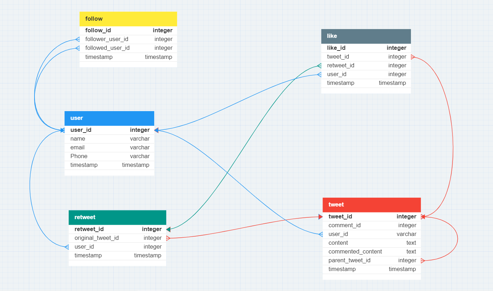

# Twitter Database Project Documentation

## Overview

This project involves designing a simplified Twitter database to handle user accounts, tweets, likes, retweets, and followers. The database schema is outlined below.

## User Table

- **user_id**: Integer (15), Primary Key
- **name**: Varchar(255)
- **email**: Varchar(255), Unique
- **phone**: Varchar(15), Unique
- **timestamp**: Timestamp

## Tweet Table

- **tweet_id**: Integer (15), Primary Key
- **comment_id**: Integer (15), Nullable
- **user_id**: Integer (15), Foreign Key -> user.user_id
- **content**: Text, Unique
- **commented_content**: Text, Nullable
- **parent_tweet_id**: Integer, Foreign Key -> tweet.tweet_id
- **timestamp**: Timestamp

## Like Table

- **like_id**: Integer, Primary Key
- **tweet_id**: Integer, Foreign Key -> tweet.tweet_id
- **retweet_id**: Integer, Foreign Key -> retweet.retweet_id
- **user_id**: Integer, Foreign Key -> user.user_id
- **timestamp**: Timestamp

## Retweet Table

- **retweet_id**: Integer, Primary Key
- **original_tweet_id**: Integer, Foreign Key -> tweet.tweet_id
- **user_id**: Integer, Foreign Key -> user.user_id
- **timestamp**: Timestamp

## Follow Table

- **follow_id**: Integer, Primary Key
- **follower_user_id**: Integer, Foreign Key -> user.user_id
- **followed_user_id**: Integer, Foreign Key -> user.user_id
- **timestamp**: Timestamp

